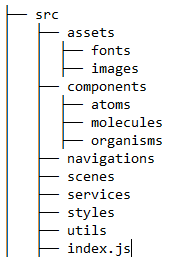

#React Native | Getting started 
##Installing
Following the steps of [this video](https://youtu.be/byhhZ2wy7sg)
> Don't forget path and download necessary packages on _**Android Studio**_
> Install necessary dependencies: 
> - chocolate
> - yarn

##Create a new project
```sh
react-native init nameProject
```
##Run app | test mode
- Open Android Studio | AVD Android Virtual Device
```sh
react-native run-android
```
> **Note:** you can change the options of App run-update on emulator o reload it through by CMD window

##Structuring our App
Add the following folders and file, follow this [guide](https://cheesecakelabs.com/blog/efficient-way-structure-react-native-projects/)


Run:
```sh
yarn add -D eslint-import-resolver-babel-module eslint-plugin-import babel-plugin-module-resolver
```

After installing the dependencies, let’s configure the **.babelrc**:

**.babelrc**
```js
{
  "plugins": [
    [
      "module-resolver",
      {
        "cwd": "babelrc",
        "root": ["./src"],
        "extensions": [".js", ".ios.js", ".android.js"],
        "alias": {
          "_assets": "./src/assets",
          "_components": "./src/components",
          "_atoms": "./src/components/atoms",
          "_molecules": "./src/components/molecules",
          "_organisms": "./src/components/organisms",
          "_navigations": "./src/navigations",
          "_scenes": "./src/scenes",
          "_services": "./src/services",
          "_styles": "./src/styles",
          "_utils": "./src/utils"
        }
      }
    ]
  ]
}
```

Edit the **.eslintrc.js** file to avoid lint errors when using the new alias:
```js
module.exports = {
  root: true,
  extends: '@react-native-community',
  plugins: ['import'],
  settings: {
    'import/resolver': {
      node: {
        paths: ['src'],
        alias: {
          _assets: './src/assets',
          _components: './src/components',
          _atoms: './src/components/atoms',
          _molecules: './src/components/molecules',
          _organisms: './src/components/organisms',
          _navigations: './src/navigations',
          _scenes: './src/scenes',
          _services: './src/services',
          _styles: './src/styles',
          _utils: './src/utils',
        },
      },
    },
  },
};
```
_Read more about alias setup at [Babel Plugin Module Resolver](https://github.com/tleunen/babel-plugin-module-resolver#getting-started)._

### Enable editors to alias autocompletion
Create the **jsconfig.json** file and use the same alias that was defined in **.babelrc**. Check it out below:
```js
{
  "compilerOptions": {
    "baseUrl": ".",
    "paths": {
      "_assets": ["src/assets/*"],
      "_components": ["src/components/*"],
      "_atoms": ["src/components/atoms/*"],
      "_molecules": ["src/components/molecules/*"],
      "_organisms": ["src/components/organisms/*"],
      "_navigations": ["src/navigations/*"],
      "_scenes": ["src/scenes/*"],
      "_services": ["src/services/*"],
      "_styles": ["src/styles/*"],
      "_utils": ["src/utils/*"]
    }
  }
}
```

Once you have edited it, it’s time to test the alias. Let’s edit our **`src/index.js`** file by adding a test component as follows:

```js
import React from 'react';
import {View,Text} from 'react-native';

const App = () => (
  <View>
    <Text>Hello World</Text>
  </View>
);

export default App;
```

Now in our **index.js** in the project root we will import the **App** component as follows:
```js
import App from './src';
```

## Atomic Components


For more info view [this page](https://cheesecakelabs.com/blog/atomic-design-react/)
